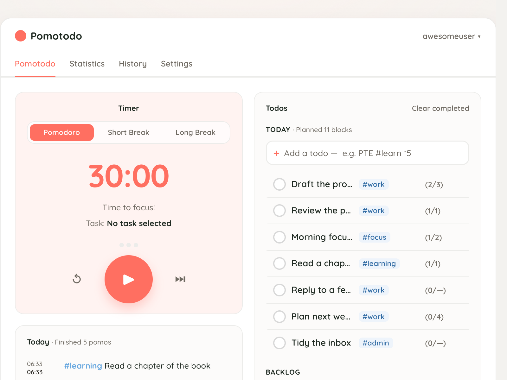

# Pomotodo

Full-stack pomodoro timer and todo tracker — focus blocks, task sync, history, and tags.



## Stack

- **Backend**: FastAPI (router / service / repository), SQLAlchemy, Alembic migrations, Pydantic schemas
- **Frontend**: vanilla JS SPA with i18n
- **TUI**: terminal client over the same API
- **Infra**: Docker + Compose (Postgres staging), `uv` packaging
- **Tests**: pytest (unit/integration) + Vitest + Playwright e2e

## Setup

```bash
uv sync
```

## Run

```bash
uv run uvicorn backend.main:app --reload
```

Open [http://127.0.0.1:8000](http://127.0.0.1:8000).

## Staging (`pomo.staging`)

Local staging runs via Docker Compose (Postgres + the app):

```bash
make staging                                      # cp .env (first time) + ensure proxy net + compose up
```

The friendly `pomo.staging` hostname is served by [local-proxy](../local-proxy),
a shared Caddy reverse proxy on `:80`. Start it once and map the host to loopback
(this machine only):

```bash
cd ../local-proxy && docker compose up -d         # shared proxy (also fronts words.staging, etc.)
echo "127.0.0.1 pomo.staging" | sudo tee -a /etc/hosts
```

The app container also binds **8001** for direct access. Open
[http://pomo.staging](http://pomo.staging) (or `http://localhost:8001`).

## Test

```bash
uv run pytest -q
```

## Task syntax

- `#tag` — add one or more tags
- `*N` — optional estimated pomodoro blocks (first `*N` wins)
- Everything else becomes the task name

Example: `PTE #learn *5`
