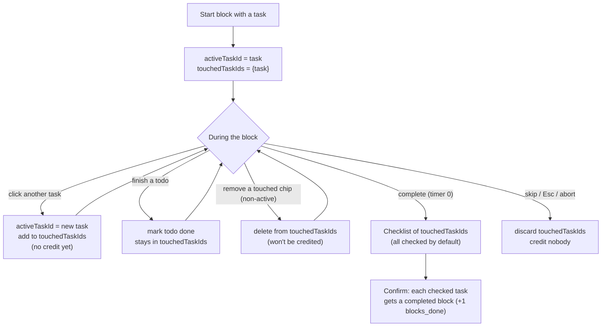

# Timer states & task-credit logic

The timer runs **stateless blocks**. A block is one timer run (e.g. 30
min); it is *not* bound to a single task. You start a block with an
initial task, and while it runs you can switch the active task or finish
todos — the timer keeps going and the block remembers every task you
touched. When the timer completes, a checklist lets you choose which
touched tasks to credit; each checked task earns **+1 done block**.
Aborting before the timer ends credits nobody.

Source of truth: `frontend/app.js`.

## State variables

| Variable | Meaning |
| --- | --- |
| `mode` | `pomodoro` (work) \| `shortBreak` \| `longBreak` |
| `running` | timer is counting down right now |
| `remainingSeconds` / `deadline` | countdown value / absolute end timestamp |
| `activeBlock` | the open work-block timer; `null` during rest or idle |
| `selectedTaskId` | task picked (idle/rest) to start the next block; `null` = none |
| `activeTaskId` | the task currently in focus inside the block |
| `touchedTaskIds` | set of tasks touched during this block (credit candidates) |
| `streakBlocks` | completed work blocks, used for short-vs-long break |

A work block is **idle** (no block), **running** (`activeBlock` +
`running`), or **paused** (`activeBlock`, `running=false`). Rest has no
block and no task — it is just **idle** or **running**.

When idle, click a task to select it and click the same task again to
**deselect**. No task is auto-selected; START is enabled even without a selection
(and the timer shows the full duration with "No task selected"). A taskless
start creates a block with no anchor task; on completion the credit modal
lists Today tasks to pick from.

While a **taskless** block runs (no active task yet), clicking a task simply
**assigns** it to the current block — no confirm, since nothing is being
replaced. The assignment is **persisted** server-side (`POST
/api/blocks/{id}/assign` sets `task_id`), so a page refresh rehydrates the
block with that task. Once a block has an active task, clicking a different
task is a **switch** and asks to confirm; switches stay client-only and do
**not** survive a reload. Either way the task joins `touchedTaskIds`.

## Work-block state machine

Notes:

- **Switch** and **Restart** never end the block — the same `activeBlock`
  keeps running. Switch only changes `activeTaskId` and grows
  `touchedTaskIds`; Restart only resets the countdown (touched set kept).
- **Abort** (Skip, Esc, or restarting your mind before completion) drops
  `touchedTaskIds` and credits no task.
- The short-vs-long break choice on completion is
  `streakBlocks % longEvery === 0 ? longBreak : shortBreak`. Auto-start of
  the next block/rest still follows the `autoStartPomodoros` /
  `autoStartRest` settings.

## Task-credit flow

Key rules:

- **No credit until completion.** Switching and finishing todos during a
  block never grant blocks; they only build the touched set.
- **Completion checklist.** On a natural finish you pick which touched
  tasks to credit (default: all). Each checked task earns one completed
  block; the streak bumps once for the block (not per task). For a block
  **started taskless**, the checklist instead lists Today tasks; any you
  touched mid-block are pre-checked.
- **Abort earns nothing.** Skip, Esc, or any abort before the timer ends
  discards the touched set.
- **Restart** re-runs the same block from its full duration without
  losing the block or its touched tasks.

## UI signals

- **Idle selection** — click a task to select (row highlighted, shown as
  the timer task); click it again to deselect. START stays enabled with no
  selection (taskless start, label "No task selected").
- **Mid-block assign/switch** — clicking a task during a running block sets it
  active. A taskless block assigns silently; a block with an active task
  confirms the switch.
- **Active-task pill** next to the timer shows `activeTaskId`.
- **"This block" chips** under the timer list `touchedTaskIds` — a live
  preview of what the completion checklist will offer. Each non-active chip
  has an ✕ to drop that task from the block before it ends; the active
  task has no ✕ (it is running).
- The active task's row stays highlighted; switching moves the highlight.
- **Completion checklist** is a small modal: the touched tasks, all
  checked, with a Confirm button.

## Counting invariants (backend)

Unchanged in `backend/repository.py`:

- A block counts toward `blocks_done`, stats, and history only when
  `completed=True`.
- Rest blocks are local and never counted.
- Restart and abort never produce a counted block.

## Changelog

- Stateless block: switch the active task mid-block (with a confirm), the
  block tracks every touched task, and a completion checklist credits each
  checked task (+1 block). Backend: `POST /blocks/{id}/credit`.
- Restart re-runs the same block from full (no new block, touched kept).
- Idle task selection is a toggle (click to select, click again to
  deselect); no task is auto-selected and START is disabled until one is
  picked.
- Mid-block, a touched task can be dropped via the ✕ on its chip (not the
  active one), removing it from the completion credit.
- Fixed first-load timer: a paused timer now requires time left, so the
  idle clock initializes to the full duration and the first START begins a
  block instead of "resuming".

## Pin to top

Each task row has a **pin** button (↑) that moves the task to the top of its
bucket (Today or Backlog). Pin uses the same server order as drag-reorder;
it is disabled while a tag filter is active.
