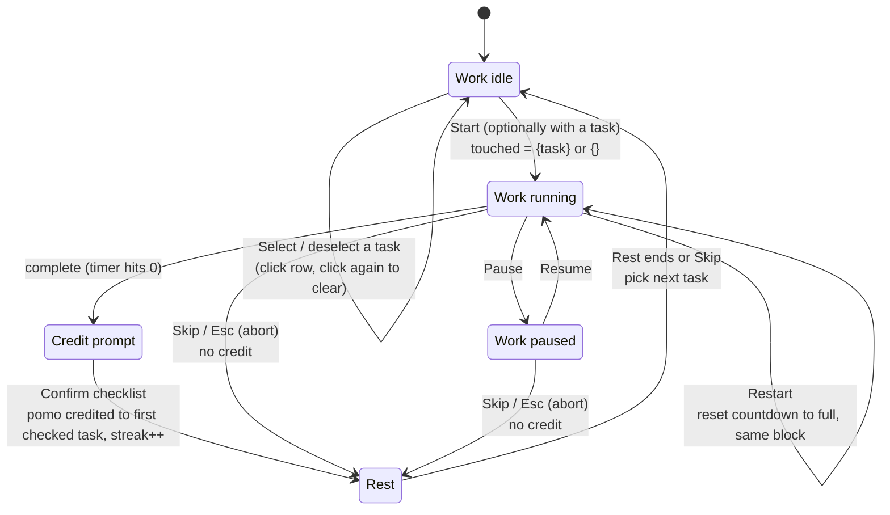
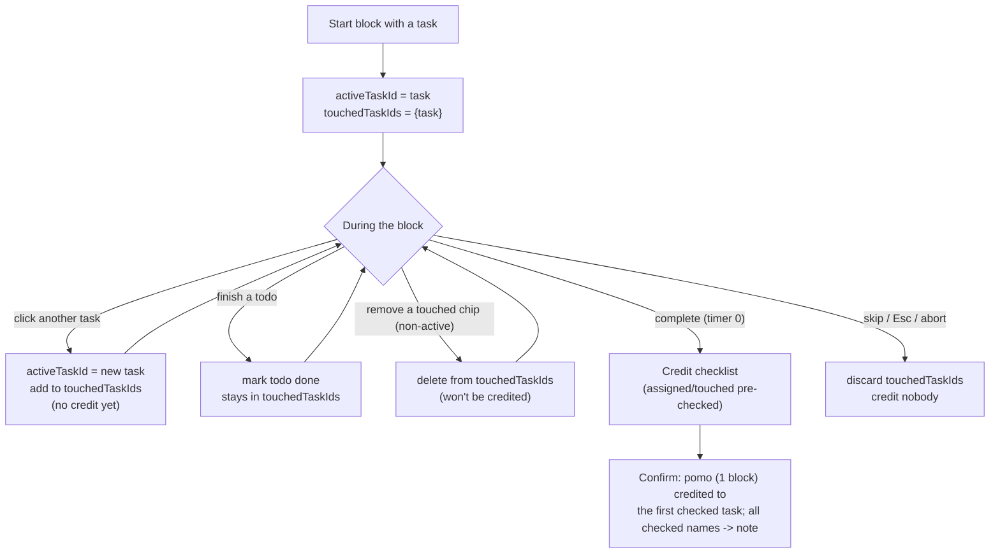

# Timer states & task-credit logic

The timer runs **stateless blocks**. A block is one timer run (e.g. 30
min); it is *not* bound to a single task. You start a block with an
initial task, and while it runs you can switch the active task or finish
todos — the timer keeps going and the block remembers every task you
touched. When the timer completes, a checklist lets you confirm what the
pomo counts toward.

**One finished pomo = one counted block, attributed to one task.** The
checklist's *first checked task* becomes the block's task (`block.task_id`);
every checked name is folded into the block's **record/note**. Checking
several tasks does **not** create several blocks — extras are note text only.
Aborting before the timer ends credits nobody.

Source of truth: `frontend/app.js`.

## State variables

| Variable | Meaning |
| --- | --- |
| `mode` | `pomodoro` (work) \| `shortBreak` \| `longBreak` |
| `running` | timer is counting down right now |
| `remainingSeconds` / `deadline` | countdown value / absolute end timestamp (epoch ms) |
| `activeBlock` | the open work-block timer; `null` during rest or idle |
| `selectedTaskId` | task picked (idle/rest) to start the next block; `null` = none |
| `activeTaskId` | the task currently in focus inside the block |
| `touchedTaskIds` | set of tasks touched during this block (credit candidates) |
| `streakBlocks` | completed work blocks, used for short-vs-long break |

A work block is **idle** (no block), **running** (`activeBlock` +
`running`), or **paused** (`activeBlock`, `running=false`). Rest has no
block and no task — it is just **idle** or **running**.

**Time is reconstructed from an absolute deadline** — the unified model the
timer and break share. A running timer persists `deadline_ms` (epoch ms) to
the server (a block via `PUT /api/blocks/{id}/timer`; a break via
`PUT /api/break`); a paused work block instead persists `paused_remaining_s`.
On reload the client restores the real remaining (running blocks count the
reload gap; paused blocks resume exactly where they were left), so neither a
running nor a paused pomodoro is lost or fast-forwarded by a refresh.

When idle, click a task to select it and click the same task again to
**deselect**. No task is auto-selected; START is enabled even without a selection
(and the timer shows the full duration with "No task selected"). A taskless
start creates a block with no anchor task; on completion the credit modal
lists Today tasks to pick from.

While a **taskless** block runs (no active task yet), clicking a task simply
**assigns** it to the current block — no confirm, since nothing is being
replaced. Once a block has an active task, clicking a different task is a
**switch** and asks to confirm. Either way the task joins `touchedTaskIds`.
Both the active task and the full touched set are **persisted** server-side
(`PUT /api/blocks/{id}/tasks`) on every change, so a reload rehydrates the
block with its active task and the whole completion checklist.

## Work-block state machine

Notes:

- **Switch** and **Restart** never end the block — the same `activeBlock`
  keeps running. Switch only changes `activeTaskId` and grows
  `touchedTaskIds`; Restart only resets the countdown (touched set kept).
- **Abort** (Skip, Esc, or restarting your mind before completion) drops
  `touchedTaskIds` and credits no task.
- The short-vs-long break choice on completion is
  `streakBlocks % longEvery === 0 ? longBreak : shortBreak`. Auto-start of
  the next block/rest still follows the `autoStartPomodoros` /
  `autoStartRest` settings.

## Task-credit flow

Key rules:

- **No credit until completion.** Switching and finishing todos during a
  block never grant blocks; they only build the touched set.
- **Completion checklist.** A natural finish produces **one** counted block,
  credited to the first checked task; all checked names go into the record.
  The streak bumps once for the block. The checklist shape depends on how the
  block started — see *Finish-time credit scenarios* below.
- **Abort earns nothing.** Skip, Esc, or any abort before the timer ends
  discards the touched set.
- **Restart** re-runs the same block from its full duration without
  losing the block or its touched tasks.

## Finish-time credit scenarios

The credit modal composes differently depending on whether the block was
started with a task. Both yield exactly one counted block.

### Scenario 1 — unassigned pomo (`block.task_id == null`)

- Lists **all Today tasks** (bucket=today, not done) to pick from.
- Any task assigned mid-block is pre-checked.
- The first checked task becomes the pomo's task; all checked names → note.
- Checking nothing → pomo recorded taskless, note still saved.

### Scenario 2 — assigned pomo (`block.task_id != null`)

- Shows the **assigned + mid-block-touched** tasks first, pre-checked — the
  *creditable* group that owns the pomo.
- A divider ("also worked on today — no credit") separates a *label-only*
  group: **every other Today task**, unchecked.
- Ticking a label-only task only appends its name to the note. It never
  reassigns the block and never adds a pomo; the pomo stays on the assigned
  task. (Client-side: label-only ids are filtered out before `POST /credit`,
  so they can't become `task_ids[0]`.)

### Feature checklist

- [ ] Unassigned finish → all Today tasks listed, touched pre-checked.
- [ ] Assigned finish → assigned/touched checked above the divider.
- [ ] Assigned finish → other Today tasks listed below, label-only, unchecked.
- [ ] Label-only ticks enrich the note only — no reassignment, no extra pomo.
- [ ] Any confirm produces exactly one counted block (first creditable check).
- [ ] Abort/skip credits nothing.

## UI signals

- **Idle selection** — click a task to select (row highlighted, shown as
  the timer task); click it again to deselect. START stays enabled with no
  selection (taskless start, label "No task selected").
- **Mid-block assign/switch** — clicking a task during a running block sets it
  active. A taskless block assigns silently; a block with an active task
  confirms the switch.
- **Active-task pill** next to the timer shows `activeTaskId`.
- **"This block" chips** under the timer list `touchedTaskIds` — a live
  preview of what the completion checklist will offer. Each non-active chip
  has an ✕ to drop that task from the block before it ends; the active
  task has no ✕ (it is running).
- The active task's row stays highlighted; switching moves the highlight.
- **Completion checklist** is a small modal whose rows depend on the finish
  scenario above: an assigned pomo shows the creditable tasks then a divider
  and the label-only Today tasks; an unassigned pomo lists Today tasks to pick.

## Counting invariants (backend)

Unchanged in `backend/repository.py`:

- A block counts toward `blocks_done`, stats, and history only when
  `completed=True`.
- Rest blocks are local and never counted.
- Restart and abort never produce a counted block.

## Changelog

- Stateless block: switch the active task mid-block (with a confirm), the
  block tracks every touched task, and a completion checklist credits the
  pomo to the first checked task (one block), folding all checked names into
  the record. Backend: `POST /blocks/{id}/credit`.
- Finish-time credit split into two scenarios: an unassigned pomo lists all
  Today tasks to pick; an assigned pomo shows the assigned/touched tasks plus
  a label-only group of the remaining Today tasks (note only, no reassignment).
- Restart re-runs the same block from full (no new block, touched kept).
- Idle task selection is a toggle (click to select, click again to
  deselect); no task is auto-selected and START stays enabled with no
  selection — a taskless start opens a block whose credit modal lists Today
  tasks.
- Mid-block, a touched task can be dropped via the ✕ on its chip (not the
  active one), removing it from the completion credit.
- Fixed first-load timer: a paused timer now requires time left, so the
  idle clock initializes to the full duration and the first START begins a
  block instead of "resuming".
- Unified time model: a running pomodoro and a break both rehydrate from an
  absolute server-side `deadline_ms` (the old `started_at + duration` elapsed
  heuristic is gone). A paused pomodoro persists `paused_remaining_s` and now
  survives a reload as paused instead of fast-forwarding to finished. Backend:
  `PUT /blocks/{id}/timer`, migration `0010_block_timer`.
- Mid-block active-task switches now persist (`PUT /blocks/{id}/tasks`) and
  survive a reload, matching taskless assigns; both restore the full touched
  set.
- Credit-on-finish converges. A transient `POST /credit` failure still keeps
  the finished block and re-opens the modal to retry, but a terminal `404`
  (the block was already closed server-side — a concurrent start swept it, or
  it was deleted) resets to idle instead of re-opening the modal forever.
- The completion checklist scrolls its task list, so Confirm stays reachable
  when many Today tasks are listed.
- Internal: dropped the redundant `pendingTaskId` (it always equalled
  `selectedTaskId` at the next-block start); `pendingTaskless` still flags an
  intentional taskless resume.

## Pin to top

Each task row has a **pin** button (↑) that moves the task to the top of its
bucket (Today or Backlog). Pin uses the same server order as drag-reorder;
it is disabled while a tag filter is active.
