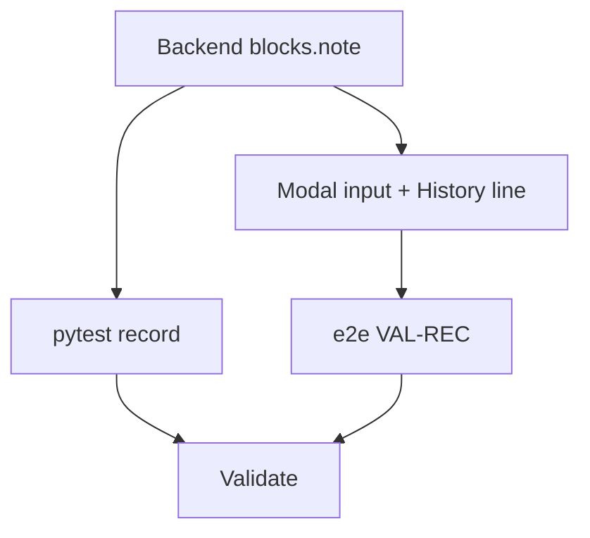

# Tasks: Editable Work-Block Record

**Goal**: Add an editable free-text record to the work-block credit modal, seeded from checked task names, saved on the block, shown in the History list in place of the task name.
**Spec Folder**: /Users/ted/workspace/pomotodo/specs/20260616-1318-editable-block-record
**Acceptance**: /Users/ted/workspace/pomotodo/specs/20260616-1318-editable-block-record/PRODUCT.md (## Acceptance, VAL-REC-*)

## Tasks

Execution: dag

```text
tasks[5]{id,title,depends_on,status,size,type,file,contract_refs,acceptance,write_set,backend,run_path,result}:
  B1,Backend: blocks.note end-to-end,,done,M,impl,backend/repository.py,"VAL-REC-004,VAL-REC-006",pytest -q,"backend/models.py,alembic/versions/0004_block_note.py,backend/schemas.py,backend/repository.py,backend/service.py,backend/api.py",claude,runs/B1/,pytest 71/71; note column+migration0004; credit chain + _block_to_dict expose note (anchor only)
  B2,Pytest for credit-with-note + default,B1,done,S,test,tests/test_block_record.py,"VAL-REC-004,VAL-REC-006",pytest -q tests/test_block_record.py,tests/test_block_record.py,claude,runs/B2/,1 passed; credit-with-note persists+history shows it; no-note defaults ""
  F1,Frontend: record input + History line,B1,done,M,impl,frontend/app.js,"VAL-REC-001,VAL-REC-002,VAL-REC-003,VAL-REC-005,VAL-REC-006",cmux browser eval tests/e2e_timer.js,"frontend/index.html,frontend/app.js,frontend/i18n.js",claude,runs/F1/,npm 12/12; #credit-record seed/live/dirty resolve {checked,note}; POST note; renderHistory note||task_name; sr-only label + styles
  E1,Add e2e VAL-REC checks and run full e2e,F1,done,S,test,tests/e2e_timer.js,"VAL-REC-001,VAL-REC-002,VAL-REC-003,VAL-REC-005,VAL-REC-006",cmux browser eval tests/e2e_timer.js,tests/e2e_timer.js,claude,runs/E1/,e2e 74/74 failedCount 0 (67 baseline + 7 VAL-REC) on clean sqlite server
  V1,Validate against acceptance,"B2,E1",done,M,review,,"VAL-REC-001,VAL-REC-002,VAL-REC-003,VAL-REC-004,VAL-REC-005,VAL-REC-006,VAL-REC-007",pytest -q && cmux browser eval tests/e2e_timer.js,,claude,runs/V1/,PASS — pytest 72/72 + e2e 74/0; VAL-REC-001..007 all satisfied
```

`status` values: `pending | in_progress | done | failed | blocked`.

### B1: Backend — blocks.note end-to-end

- `backend/models.py`: `Block.note: Mapped[str] = mapped_column(Text, default="")`
  (mirror `Task.note`).
- `alembic/versions/0004_block_note.py`: `down_revision = "0003_task_archived"`;
  upgrade `op.add_column("blocks", sa.Column("note", sa.Text(), nullable=False,
  server_default=""))`; downgrade drops it.
- `backend/schemas.py`: `CreditBlockRequest` += `note: str = ""`; `StatsBlock`
  += `note: str = ""`.
- `backend/repository.py` `credit_block(block_id, task_ids, note)`: set
  `block.note = note` on the **anchor** block only (extras keep `""`); include
  `note` in the History pomos row builder feeding `HistoryResponse.pomos`.
- `backend/service.py` `credit_block(block_id, task_ids, note)`: pass through.
- `backend/api.py` credit route: pass `body.note`.

Acceptance: `pytest -q` green (existing suite still passes with the new column).
Contract refs: VAL-REC-004, VAL-REC-006

### B2: Pytest for credit-with-note + default

`tests/test_block_record.py` (sqlite `Service` fixture, mirror
tests/test_bucket.py): one test `test_credit_saves_note` — credit a block with
`note="shipped the thing"`, assert the anchor block row persisted it and history
exposes it; credit another with no note, assert it defaults `""`.
Contract refs: VAL-REC-004, VAL-REC-006

### F1: Frontend — record input + History line

- `index.html`: add `<input type="text" id="credit-record">` with an a11y label
  (aria-label or visually-hidden label) inside `#credit-modal`, between
  `#credit-list` and `.modal-actions`.
- `app.js` `openCreditModal`: seed input from checked task names joined `" + "`;
  on checkbox `change` re-seed if not `dirty`; on `input` set `dirty=true`;
  resolve `{checked, note}`. Update `completeBlockWithCredit` to POST `note`.
- `app.js` `renderHistory`: render `escapeHtml(b.note || b.task_name)` (one line).
  Leave `renderTodayLog` unchanged.
- `i18n.js`: one `credit.record` label key (EN+ZH). No placeholder key.

Acceptance: verified by E1 (in-browser). 
Contract refs: VAL-REC-001, VAL-REC-002, VAL-REC-003, VAL-REC-005, VAL-REC-006

### E1: Add e2e VAL-REC checks and run full e2e

`tests/e2e_timer.js` `VAL-REC` block: open a real credit modal, assert
`#credit-record` seeding (001), re-seed on uncheck (002), manual-edit preserved
across a toggle (003); confirm a custom record, re-sync, assert the History line
shows the record (005) and a no-note block shows the name (006). Run full e2e on
a clean sqlite server → `{"failedCount":0}`.
Contract refs: VAL-REC-001, VAL-REC-002, VAL-REC-003, VAL-REC-005, VAL-REC-006

### V1: Validate against acceptance

Fresh check of `## Acceptance`: `pytest -q` green (incl. test_block_record) and
e2e `{"failedCount":0}` (VAL-REC-007), VAL-REC-001..006 evidence present.
Contract refs: VAL-REC-001..006, VAL-REC-007

## Dependency View

TOON `depends_on` is the source of truth.

```text
Requires:
  B1:
  B2: B1
  F1: B1
  E1: F1
  V1: B2 E1

Batches:
  1: B1
  2: B2 F1
  3: E1
  4: V1
```


