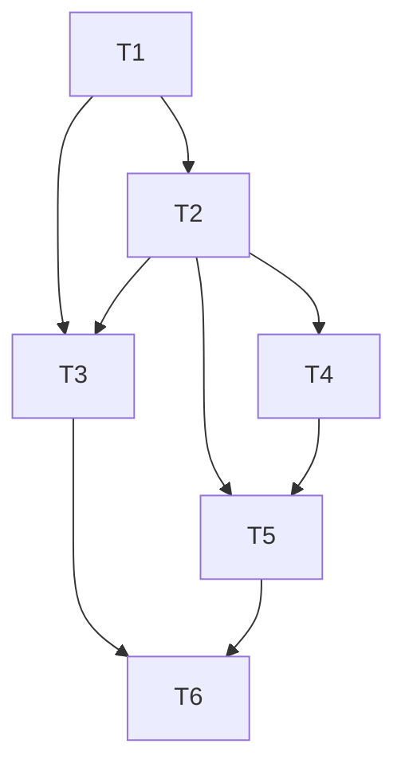

# TASKS — Pomo de-dup + soft-delete

Execution: dag

```toon
id,title,depends_on,status,size,type,file,contract_refs,acceptance,write_set,backend,run_path,result
T1,De-dup credit: one pomo per session,,done,M,impl,backend/repository.py,"VAL-DEDUP-001,VAL-DEDUP-002,VAL-DEDUP-003","uv run pytest tests/test_block_record.py -k \"dedup or attribut or count\"","backend/repository.py,backend/service.py",codex,runs/T1/,"smoke ok: credit A+B->1 pomo note combined; start A credit only B->attributed to B; 2 blocks->count 2. pytest acceptance with T3"
T2,Block.archived soft-delete + stats exclusion + DELETE route,T1,done,L,impl,backend/repository.py,"VAL-PDEL-001,VAL-PDEL-002,VAL-TDEL-001","uv run pytest tests/test_block_delete.py","alembic/versions/0005_block_archived.py,backend/models.py,backend/repository.py,backend/service.py,backend/api.py,backend/schemas.py",codex,runs/T2/,"smoke ok: DELETE /api/blocks/{id} 204/404; archived block excluded from history+stats; deleted todo KEEPS pomos (keeps_history 2 pass); StatsBlock.id exposed over HTTP. archived-task exclusion reverted per decision. pytest acceptance with T3."
T3,Backend tests: dedup + block/todo soft-delete,"T1,T2",done,M,test,tests/test_block_delete.py,"VAL-DEDUP-001,VAL-DEDUP-002,VAL-DEDUP-003,VAL-PDEL-001,VAL-PDEL-002,VAL-TDEL-001","uv run pytest -q","tests/test_block_record.py,tests/test_block_delete.py,tests/test_bucket.py",codex,runs/T3/,"acceptance PASS (orchestrator): full suite 40 passed; selectors dedup/attribut/count/pomo_soft_delete/pomo_stats/todo_keeps all pass. Validates T1+T2. Old multi-credit tests updated to one-pomo."
T4,Web History delete UI for pomos + todos,T2,done,M,impl,frontend/app.js,VAL-UI-001,"uv run pytest -q","frontend/app.js,frontend/index.html,frontend/i18n.js",cursor,runs/T4/,"static ok: delete-pomo(data-id=b.id)/delete-todo(non-archived) buttons; handler @1676 DELETE /api/blocks|tasks + reloadHistory + refreshStatsIfLoaded; i18n en+zh. UI verified by T5 e2e. suite 40 passed (unaffected)."
T5,e2e: one-pomo VAL-REC update + VAL-DEL delete checks,"T2,T4",done,M,test,tests/e2e_timer.js,"VAL-UI-001,VAL-REG-001","cmux browser eval tests/e2e_timer.js -> failedCount 0",tests/e2e_timer.js,claude,runs/T5/,"PASS: cmux e2e 80 passed failedCount 0. VAL-REC one-pomo, VAL-DEDUP-001, VAL-DEL pomo+todo via real History buttons. VAL-UI-001 + VAL-REG-001 ✓"
T6,Review vs acceptance + full suite,"T3,T5",done,M,review,README.md,"VAL-DEDUP-001,VAL-DEDUP-002,VAL-DEDUP-003,VAL-PDEL-001,VAL-PDEL-002,VAL-TDEL-001,VAL-UI-001,VAL-REG-001","uv run pytest -q",,codex,runs/T6/,"GATE PASS: fresh codex review, all 8 VAL PASS, migration chain 0004->0005 ok, no bugs. Orchestrator: uv run pytest -q 40 passed."
```

## Dependency view

Requires:
- T1: —
- T2: T1
- T3: T1, T2
- T4: T2
- T5: T2, T4
- T6: T3, T5

Batches:
- Batch 1: T1
- Batch 2: T2
- Batch 3 (parallel): T3, T4
- Batch 4: T5
- Batch 5: T6



## Task notes

- **T1**: In `backend/repository.py` `credit_block(block_id, task_ids, note)`: close
  the anchor block (`ended_at=now`), set `completed=True`, `note=note`. If the
  anchor's own `task_id` is not in `task_ids` and `task_ids` is non-empty, re-point
  `block.task_id` to `task_ids[0]` so the single pomo is attributed to a credited
  task. Remove the loop that creates extra `Block` rows. Return `1` (or `0`/`None`
  if the block is missing). `backend/service.py` `credit_block` keeps its signature;
  it returns the count from the repo. Do not touch the timer engine or frontend.
  Pytest acceptance lands with T3.
- **T2**: Add `alembic/versions/0005_block_archived.py` (revises `0004_block_note`)
  adding `blocks.archived` BOOLEAN NOT NULL DEFAULT 0 (mirror `0003_task_archived`).
  `backend/models.py`: `Block.archived` mapped column default False. `repository.py`:
  add `archive_block(block_id)->bool`; add `Block.archived.is_(False)` (BLOCKS only,
  NOT archived-task) to `get_completed_blocks_page`, `count_completed_blocks`,
  `get_task_block_stats`, `get_tag_summaries`, `get_completed_blocks`. Add
  `id: int` to `schemas.StatsBlock`. [Revised: deleted todos keep their pomos.]
  `service.py`: `delete_block(block_id)` → `archive_block`, raise `NotFoundError`
  when missing (mirror `delete_task`). `api.py`: `DELETE /api/blocks/{block_id}` →
  `service.delete_block`, 204. Pytest acceptance lands with T3.
- **T3**: Update `tests/test_block_record.py` to the one-pomo model (replace the
  multi-pomo `test_credit_note_on_every_credited_pomo`): credit A+B → one completed
  block with the note, no extra rows (`dedup`); start A / credit only B → one pomo
  attributed to B, A absent (`attribut`); two blocks (one multi-credit) →
  `count_completed_blocks()==2` (`count`); keep single-task note + empty-note cases.
  New `tests/test_block_delete.py`: pomo soft-delete leaves History + keeps row
  (`pomo_soft_delete`/`history`); excluded from count/blocks_done/tags
  (`pomo_stats`); deleting a TODO KEEPS its pomos in stats+history (`todo_keeps`,
  mirrors existing `test_bucket *_keeps_history`); `delete_block` missing id raises
  `NotFoundError`. (No archived-task stats exclusion — reverted per decision.) Use the `Service(Repository(...))`
  fixture and/or `app_transport` for the DELETE route.
- **T4**: In `frontend/app.js` `renderHistory`: add a `🗑` delete button to each
  History pomo row (`data-action="delete-pomo" data-id="{block.id}"`) and to each
  non-archived History todo row (`data-action="delete-todo" data-id="{task.id}"`).
  Wire a click handler: delete-pomo → `DELETE /api/blocks/{id}`; delete-todo →
  `DELETE /api/tasks/{id}`; then re-fetch history (+ stats if loaded) and re-render.
  Add i18n keys in `frontend/i18n.js` (en + zh) and any markup in
  `frontend/index.html`. Reuse the existing `api()` helper. Validated by T5 e2e.
- **T5**: In `tests/e2e_timer.js`: update the VAL-REC block to the one-pomo model
  (a single credited block carries the note; no second per-task pomo). Add a
  `VAL-DEL` block reusing helpers (`start`, `expire`, `confirmCredit`, `state`,
  `el`, `openHistory`): complete a pomo, click its History delete control, assert
  it leaves `state.history.pomos` and the count drops; delete a todo from History
  and assert it renders as deleted. Run the whole file via cmux browser eval against
  a clean sqlite uvicorn; assert `{"failedCount":0}`.
- **T6**: Independent review against `PRODUCT.md` `## Acceptance` (all VAL ids);
  confirm de-dup, attribution, soft-delete + stats exclusion, and UI. Run
  `uv run pytest -q` (green) and confirm the e2e report. Update README only if
  behavior/usage changed enough to mislead.
```
