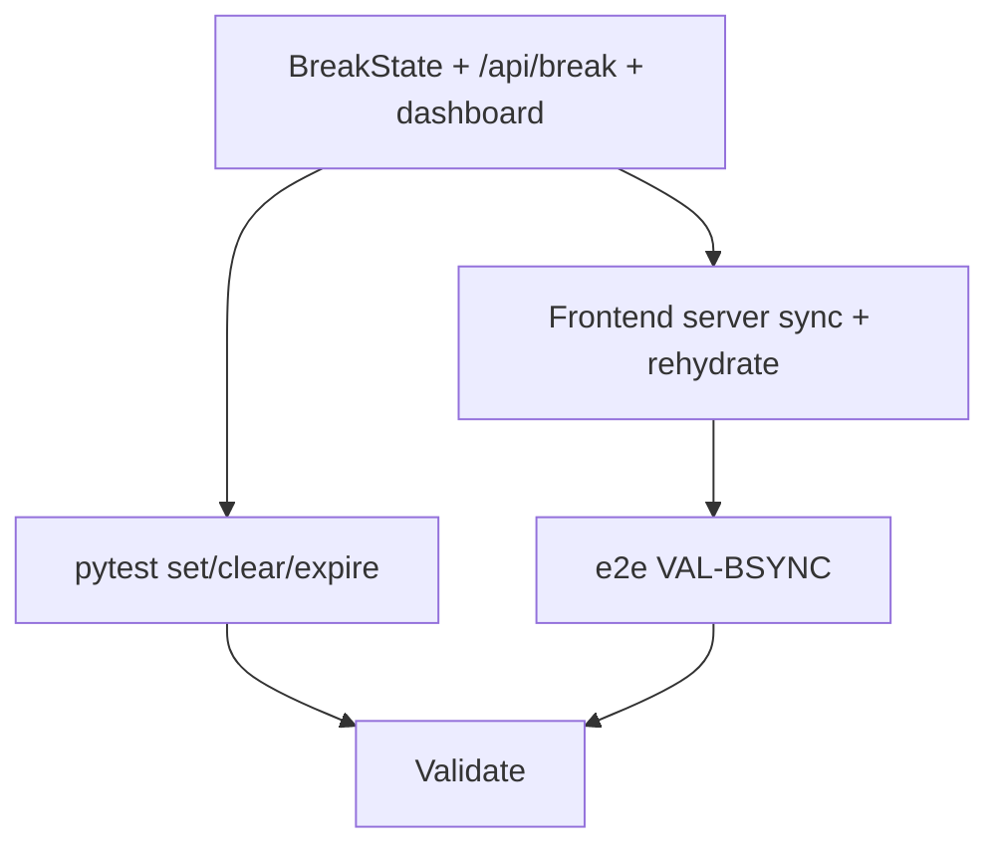

# Tasks: Cross-Device Break Sync

**Goal**: Store a running break on the server (singleton, global) so opening the app on another device resumes it; retire the localStorage break path.
**Spec Folder**: /Users/ted/workspace/pomotodo/specs/20260616-1813-break-server-sync
**Acceptance**: /Users/ted/workspace/pomotodo/specs/20260616-1813-break-server-sync/PRODUCT.md (## Acceptance, VAL-BSYNC-*)

## Tasks

Execution: dag

```text
tasks[5]{id,title,depends_on,status,size,type,file,contract_refs,acceptance,write_set,backend,run_path,result}:
  B1,Backend: BreakState singleton + /api/break + dashboard,,done,M,impl,backend/repository.py,"VAL-BSYNC-001,VAL-BSYNC-004,VAL-BSYNC-005",pytest -q,"backend/models.py,alembic/versions/0006_break_state.py,backend/schemas.py,backend/repository.py,backend/service.py,backend/api.py",claude,runs/B1/,pytest 40/40; BreakState singleton + lazy-expire get_break; PUT/DELETE /api/break; dashboard.break_state; migration 0006 on 0005_block_archived
  B2,Pytest for set/clear/expire break,B1,done,S,test,tests/test_break_sync.py,"VAL-BSYNC-001,VAL-BSYNC-004,VAL-BSYNC-005",pytest -q tests/test_break_sync.py,tests/test_break_sync.py,claude,runs/B2/,3 passed; set/read/clear/expire break_state via dashboard
  F1,Frontend: server syncBreak + rehydrate; drop localStorage,B1,done,M,impl,frontend/app.js,"VAL-BSYNC-001,VAL-BSYNC-002,VAL-BSYNC-003,VAL-BSYNC-004",cmux browser eval tests/e2e_timer.js,frontend/app.js,claude,runs/F1/,npm 12/12; syncBreak diff-guarded PUT/DELETE replaces persistBreak; rehydrate reads dashboard.break_state; localStorage break path removed; rehydrated guard kept for cross-device safety
  E1,Rework VAL-BRK→VAL-BSYNC e2e and run full e2e,F1,done,M,test,tests/e2e_timer.js,"VAL-BSYNC-001,VAL-BSYNC-002,VAL-BSYNC-003,VAL-BSYNC-004",cmux browser eval tests/e2e_timer.js,tests/e2e_timer.js,claude,runs/E1/,e2e 79/79 failedCount 0 (75 baseline + 4 VAL-BSYNC); fixed: end lingering server block at section start so forced rehydrate doesn't pop a credit modal into the next section
  V1,Validate against acceptance,"B2,E1",done,M,review,,"VAL-BSYNC-001,VAL-BSYNC-002,VAL-BSYNC-003,VAL-BSYNC-004,VAL-BSYNC-005,VAL-BSYNC-006",pytest -q && cmux browser eval tests/e2e_timer.js,,claude,runs/V1/,PASS — pytest 43/43 + e2e 79/0; VAL-BSYNC-001..006 satisfied
```

`status` values: `pending | in_progress | done | failed | blocked`.

### B1: Backend — BreakState singleton + /api/break + dashboard

- `models.py`: `BreakState` — `id` PK (=1), `mode: str`, `deadline_ms: BigInteger`.
- `alembic/versions/0005_break_state.py`: create table; `down_revision =
  "0004_block_note"`.
- `repository.py`: `set_break(mode, deadline_ms)` upsert id=1; `clear_break()`;
  `get_break()` → `{mode, deadline}` or None, deleting + returning None when
  `deadline_ms <= now_ms` (lazy expire).
- `service.py`: pass-throughs; `get_dashboard` adds `break_state =
  get_break()`.
- `schemas.py`: `BreakStateOut {mode: str, deadline: int}`; `DashboardResponse`
  += `break_state: BreakStateOut | None = None`; request model `SetBreakRequest
  {mode, deadline}`.
- `api.py`: `PUT /api/break` → set; `DELETE /api/break` → clear.

Acceptance: `pytest -q` green with the new table/routes.
Contract refs: VAL-BSYNC-001, VAL-BSYNC-004, VAL-BSYNC-005

### B2: Pytest for set/clear/expire break

`tests/test_break_sync.py` (sqlite `Service` fixture): `test_set_and_read_break`
(set → dashboard `break_state` matches), `test_clear_break` (clear → null),
`test_expired_break_is_none` (deadline in the past → dashboard null + row gone).
Contract refs: VAL-BSYNC-001, VAL-BSYNC-004, VAL-BSYNC-005

### F1: Frontend — server syncBreak + rehydrate; drop localStorage

- Remove `BREAK_KEY`, localStorage writes in `persistBreak`, `maybeRehydrateBreak`
  localStorage read, and the `state.rehydrated` guard that only protected it.
- Add `syncBreak()` (diff-guarded PUT/DELETE to `/api/break`, fire-and-forget),
  called where `persistBreak()` was in `renderTimer`. Track `lastBreakKey`.
- `maybeRehydrateTimer`: keep `running_block` preferred; restore from
  `state.dashboard.break_state` when present (remaining from deadline; advance if
  ≤0). Seed `lastBreakKey` to the restored value so the re-render doesn't re-PUT.

Acceptance: verified by E1.
Contract refs: VAL-BSYNC-001, VAL-BSYNC-002, VAL-BSYNC-003, VAL-BSYNC-004

### E1: Rework VAL-BRK→VAL-BSYNC e2e and run full e2e

Replace the localStorage `VAL-BRK` block with `VAL-BSYNC` (server): start a break
→ assert `GET /api/dashboard` `break_state` set (001); second-device sim (clear
live state, `state.rehydrated=false`, no `running_block`, `await syncNow()`) →
break resumed (002); plant a `running_block` → pomodoro wins (003); switch to
pomodoro → dashboard `break_state` null (004). Run full e2e on a clean sqlite
server → `{"failedCount":0}`.
Contract refs: VAL-BSYNC-001, VAL-BSYNC-002, VAL-BSYNC-003, VAL-BSYNC-004

### V1: Validate against acceptance

`pytest -q` green (incl. test_break_sync) + e2e `{"failedCount":0}`
(VAL-BSYNC-006), VAL-BSYNC-001..005 evidence present.
Contract refs: VAL-BSYNC-001..006

## Dependency View

```text
Requires:
  B1:
  B2: B1
  F1: B1
  E1: F1
  V1: B2 E1

Batches:
  1: B1
  2: B2 F1
  3: E1
  4: V1
```


