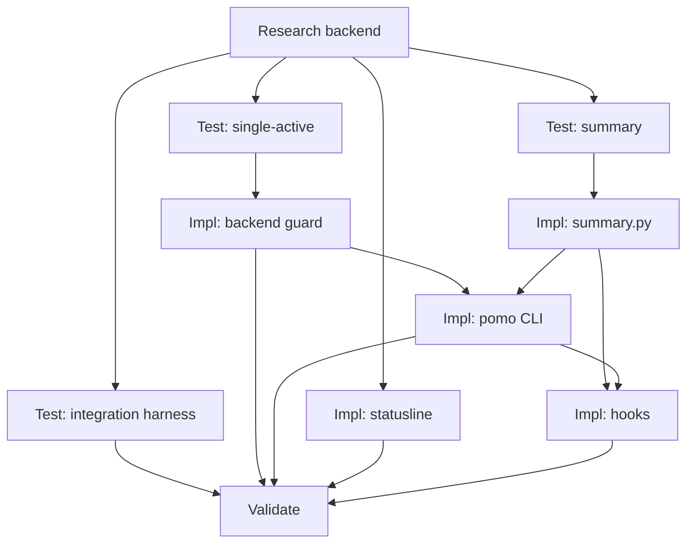

# Tasks: Claude Code ↔ Pomotodo Integration

**Goal**: Run the pomodoro loop inside Claude Code (start / countdown / rest
nudge / auto-captured note) as a thin client over the existing backend.
**Spec Folder**: /Users/ted/workspace/pomotodo/specs/20260617-0034-claude-code-pomo-integration
**Acceptance**: /Users/ted/workspace/pomotodo/specs/20260617-0034-claude-code-pomo-integration/PRODUCT.md (## Acceptance, VAL-CC-* ids)

## Tasks

Execution: dag

```text
tasks[10]{id,title,depends_on,status,size,type,file,contract_refs,acceptance,write_set,backend,run_path,result}:
  T1,Confirm backend single-active + launch/port,,pending,S,research,backend/service.py,,,,claude,,
  T2,Backend single-active-pomo invariant test,T1,pending,M,test,tests/test_single_active_block.py,VAL-CC-002,uv run pytest -q tests/test_single_active_block.py,tests/test_single_active_block.py,codex,runs/T2/,
  T3,summary.py transcript-to-note unit test,T1,pending,M,test,tests/test_cc_summary.py,VAL-CC-005,uv run pytest -q tests/test_cc_summary.py,tests/test_cc_summary.py,codex,runs/T3/,
  T4,Client integration test harness,T1,pending,L,test,tests/test_claude_code_integration.py,"VAL-CC-001,VAL-CC-002,VAL-CC-003,VAL-CC-004,VAL-CC-005,VAL-CC-006",uv run pytest -q tests/test_claude_code_integration.py,tests/test_claude_code_integration.py,codex,runs/T4/,
  T5,Backend single-active guard if needed,T2,pending,M,impl,backend/service.py,VAL-CC-002,uv run pytest -q tests/test_single_active_block.py,backend/service.py,codex,runs/T5/,
  T6,summary.py capture heuristic,T3,pending,M,impl,integrations/claude-code/summary.py,VAL-CC-005,uv run pytest -q tests/test_cc_summary.py,integrations/claude-code/summary.py,cursor,runs/T6/,
  T7,pomo CLI start/status/done,"T5,T6",pending,M,impl,integrations/claude-code/pomo,"VAL-CC-001,VAL-CC-002,VAL-CC-005",uv run pytest -q tests/test_claude_code_integration.py,integrations/claude-code/pomo,cursor,runs/T7/,
  T8,Statusline countdown script,T1,pending,S,impl,integrations/claude-code/statusline.sh,VAL-CC-003,uv run pytest -q tests/test_claude_code_integration.py,integrations/claude-code/statusline.sh,cursor,runs/T8/,
  T9,Hooks + settings.example + README,"T6,T7",pending,M,impl,integrations/claude-code/hooks/,"VAL-CC-004,VAL-CC-006",uv run pytest -q tests/test_claude_code_integration.py,"integrations/claude-code/hooks/on_stop.py,integrations/claude-code/hooks/on_prompt.py,integrations/claude-code/hooks/on_session_start.py,integrations/claude-code/settings.example.json,integrations/claude-code/README.md",cursor,runs/T9/,
  T10,Validate against acceptance,"T4,T5,T7,T8,T9",pending,M,review,specs/20260617-0034-claude-code-pomo-integration/PRODUCT.md,"VAL-CC-001,VAL-CC-002,VAL-CC-003,VAL-CC-004,VAL-CC-005,VAL-CC-006",uv run pytest -q tests/test_claude_code_integration.py,,codex,runs/T10/,
```

`status` values: `pending | in_progress | done | failed | blocked`.

### T1: Confirm backend single-active + launch/port

Read `backend/service.py`, `backend/repository.py`. Determine: (a) does
`start_block` already prevent a second running block when one exists, or would a
second call create a duplicate? (b) the normal local launch command + port for
the dev server (CLAUDE.md uses 8731 for the throwaway test server) so the
`POMOTODO_API` default is correct. Record both in FINDINGS. No code changes.
Contract refs: (none — research)

### T2: Backend single-active-pomo invariant test

Write `tests/test_single_active_block.py`: starting a block when a `running_block`
already exists must not yield two running blocks — the second start returns/keeps
the existing one. Follow existing backend test style over `backend/`. Test must
encode VAL-CC-002 regardless of T1's finding (if the backend already satisfies
it, the test passes as-is).
Contract refs: VAL-CC-002

### T3: summary.py transcript-to-note unit test

Write `tests/test_cc_summary.py`: feed a synthetic Claude transcript JSONL
(entries with Edit/Write tool inputs naming files, Bash inputs, multiple turns)
to the summary function; assert the returned note string lists the edited files
and a command count. Pure function test, no server.
Contract refs: VAL-CC-005

### T4: Client integration test harness

Write `tests/test_claude_code_integration.py`. Boot a throwaway server per
CLAUDE.md (`POMOTODO_DATABASE_URL=sqlite:////tmp/pomo_cc_test.db`, `alembic
upgrade head`, `uvicorn backend.main:app` on a free test port; tear down after).
Drive the `pomo` CLI, the hook scripts, and `statusline.sh` as subprocesses with
`POMOTODO_API` pointed at the test server. Assertions, one per VAL: start creates
a `running_block` (001); a second start does not duplicate (002); statusline
prints remaining for a seeded block and nothing when idle (003); the expiry hook
emits a reminder for an expired block (004); `pomo done` credits the block with a
non-empty derived note (005); two distinct session ids resolve the same active
block id (006). The harness is written before impl and is expected to fail until
T6–T9 land.
Contract refs: VAL-CC-001, VAL-CC-002, VAL-CC-003, VAL-CC-004, VAL-CC-005, VAL-CC-006

### T5: Backend single-active guard if needed

Only if T1 found the backend can create a duplicate running block: add a guard in
`service.start_block` — when a `running_block` exists, return it instead of
starting a second (idempotent start). Smallest safe change; no API signature
change. If T1 found the invariant already holds, this task is a no-op closed with
that note.
Contract refs: VAL-CC-002

### T6: summary.py capture heuristic

Implement `integrations/claude-code/summary.py`: read a transcript JSONL path,
optionally filtered to entries at/after a given start timestamp, and return a
compact note string — edited/written files (from Edit/Write tool inputs),
command count (Bash inputs), turn count, e.g. `CC: edited app.js, service.py;
6 cmds; 9 turns`. Stdlib only. Offline, no LLM.
Contract refs: VAL-CC-005

### T7: pomo CLI start/status/done

Implement `integrations/claude-code/pomo` (python3, stdlib `urllib`, executable).
`POMOTODO_API` env (default from T1). Subcommands:
- `start [task text]` — read `GET /dashboard`; if `running_block` exists, print it
  and exit (no duplicate, VAL-CC-002); else quick-create a task
  (`POST /tasks`) when text given (or a default placeholder), then
  `POST /tasks/{id}/blocks` and print the deadline (VAL-CC-001).
- `status` — print the active pomo + remaining, or "no pomo".
- `done` — read `running_block`; build a note via `summary.py` over the current
  transcript; `POST /blocks/{id}/credit` with that note (VAL-CC-005).
Contract refs: VAL-CC-001, VAL-CC-002, VAL-CC-005

### T8: Statusline countdown script

Implement `integrations/claude-code/statusline.sh`: query `GET /dashboard`, and
if a `running_block` with a future deadline exists print `🍅 MM:SS` remaining;
otherwise print nothing (or an idle marker). Must be fast and never error the
statusline (fail silent on no server).
Contract refs: VAL-CC-003

### T9: Hooks + settings.example + README

Implement the three hook scripts reading Claude's stdin JSON (`transcript_path`,
`session_id`) and resolving the target pomo from `GET /dashboard.running_block.id`
(never from `session_id` — VAL-CC-006):
- `hooks/on_prompt.py` (UserPromptSubmit) and `hooks/on_stop.py` (Stop) — if the
  active pomo is expired, print a "time to rest" reminder (VAL-CC-004). `on_stop`
  may also append/refresh capture via `summary.py`.
- `hooks/on_session_start.py` (SessionStart) — announce/resume whatever pomo the
  server reports running.
Add `settings.example.json` wiring statusLine + the three hooks (see TECH) and a
`README.md` with install steps (copy settings, set `POMOTODO_API`).
Contract refs: VAL-CC-004, VAL-CC-006

### T10: Validate against acceptance

Fresh-eyed validation against PRODUCT ## Acceptance. Run the integration test and
the unit tests; confirm each VAL-CC-* has passing evidence. Flag any gap rather
than patching silently.
Contract refs: VAL-CC-001, VAL-CC-002, VAL-CC-003, VAL-CC-004, VAL-CC-005, VAL-CC-006

## Dependency View

TOON `depends_on` remains the source of truth.

```text
Requires:
  T1:
  T2: T1
  T3: T1
  T4: T1
  T5: T2
  T6: T3
  T7: T5 T6
  T8: T1
  T9: T6 T7
  T10: T4 T5 T7 T8 T9

Batches:
  1: T1
  2: T2 T3 T4 T8
  3: T5 T6
  4: T7
  5: T9
  6: T10
```


