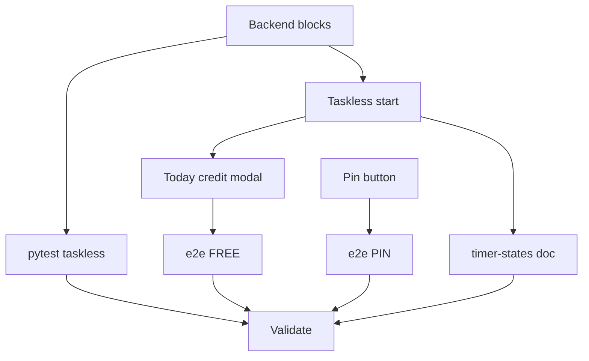

# Tasks: Taskless Pomodoro + Pin Tasks

**Goal**: Allow taskless pomodoro start with Today-list credit on finish; add pin-to-top on task rows.
**Spec Folder**: /Users/ted/workspace/pomotodo/specs/20260617-1646-taskless-pomodoro
**Acceptance**: /Users/ted/workspace/pomotodo/specs/20260617-1646-taskless-pomodoro/PRODUCT.md (## Acceptance, VAL-FREE-* + VAL-PIN-*)

## Tasks

Execution: dag

```text
tasks[9]{id,title,depends_on,status,size,type,file,contract_refs,acceptance,write_set,backend,run_path,result}:
  B1,Backend: nullable block.task_id + POST /api/blocks,,pending,M,impl,backend/models.py,"VAL-FREE-002,VAL-FREE-005",pytest -q,"backend/models.py,alembic/versions/0008_block_task_nullable.py,backend/repository.py,backend/service.py,backend/schemas.py,backend/api.py",cursor,runs/B1/,
  B2,Pytest taskless start + credit,B1,pending,S,test,tests/test_taskless_block.py,VAL-FREE-005,pytest -q tests/test_taskless_block.py,tests/test_taskless_block.py,cursor,runs/B2/,
  F1,Frontend: taskless start + rehydrate + auto-start,B1,pending,M,impl,frontend/app.js,"VAL-FREE-001,VAL-FREE-002,VAL-FREE-003",npm test,frontend/app.js,cursor,runs/F1/,
  F2,Frontend: Today-list credit modal + i18n,F1,pending,M,impl,frontend/app.js,"VAL-FREE-004,VAL-FREE-005,VAL-FREE-006",npm test,"frontend/app.js,frontend/i18n.js",cursor,runs/F2/,
  F3,Frontend: pin button + reorder handler,,pending,M,impl,frontend/app.js,"VAL-PIN-001,VAL-PIN-002,VAL-PIN-003,VAL-PIN-004",npm test,"frontend/app.js,frontend/style.css,frontend/i18n.js",cursor,runs/F3/,
  E1,E2e VAL-FREE checks + update VAL-1,F2,pending,M,test,tests/e2e_timer.js,"VAL-FREE-001,VAL-FREE-002,VAL-FREE-004,VAL-FREE-005,VAL-FREE-006",cmux browser eval tests/e2e_timer.js,tests/e2e_timer.js,cursor,runs/E1/,
  E2,E2e VAL-PIN checks in e2e_buckets,F3,pending,S,test,tests/e2e_buckets.js,"VAL-PIN-001,VAL-PIN-002,VAL-PIN-003,VAL-PIN-004",cmux browser eval tests/e2e_buckets.js,tests/e2e_buckets.js,cursor,runs/E2/,
  D1,Update timer-states.md,F1,pending,S,impl,docs/timer-states.md,VAL-FREE-007,markdownlint docs/timer-states.md,docs/timer-states.md,cursor,runs/D1/,
  V1,Validate acceptance,"B2,E1,E2,D1",pending,M,review,,"VAL-FREE-001,VAL-FREE-002,VAL-FREE-003,VAL-FREE-004,VAL-FREE-005,VAL-FREE-006,VAL-FREE-007,VAL-PIN-001,VAL-PIN-002,VAL-PIN-003,VAL-PIN-004",pytest -q && npm test,,cursor,runs/V1/,
```

### B1: Backend — nullable block.task_id + POST /api/blocks

Migration, model, repository null-safety, `POST /api/blocks`, schemas.
Contract refs: VAL-FREE-002, VAL-FREE-005

### B2: Pytest taskless start + credit

`tests/test_taskless_block.py` — unanchored start + credit repoints task.
Contract refs: VAL-FREE-005

### F1: Frontend — taskless start + rehydrate + auto-start

Enable START without selection; `startBlock(null)`; rehydrate + auto-start paths.
Contract refs: VAL-FREE-001, VAL-FREE-002, VAL-FREE-003

### F2: Frontend — Today-list credit modal + i18n

`todayCreditCandidates()`, widen `openCreditModal`, `credit.titleUntethered`.
Contract refs: VAL-FREE-004, VAL-FREE-005, VAL-FREE-006

### F3: Frontend — pin button + reorder handler

- `rowHtml`: add `data-action="pin"` button; disabled when tag filter active.
- `handleTaskClick` / `pinTask`: build full-bucket order, PATCH `/api/tasks/order`.
- `style.css`: `.row-pin`, widen `.row-actions`.
- `i18n.js`: `row.pin` EN+ZH.

No backend work — reuses existing reorder endpoint.
Contract refs: VAL-PIN-001, VAL-PIN-002, VAL-PIN-003, VAL-PIN-004

### E1: E2e VAL-FREE checks + update VAL-1

Replace VAL-1 disabled check; add VAL-FREE-002..006.
Contract refs: VAL-FREE-001..007

### E2: E2e VAL-PIN checks in e2e_buckets

Pin second task to top; assert sync persistence; assert disabled under filter.
Contract refs: VAL-PIN-001..004

### D1: Update timer-states.md

Document taskless flow (pin needs no doc change).
Contract refs: VAL-FREE-007

### V1: Validate acceptance

pytest + npm test + e2e_timer + e2e_buckets green.
Contract refs: VAL-FREE-001..007, VAL-PIN-001..004

## Dependency View

```text
Requires:
  B1:
  B2: B1
  F1: B1
  F2: F1
  F3:
  E1: F2
  E2: F3
  D1: F1
  V1: B2 E1 E2 D1

Batches:
  1: B1 F3
  2: B2 F1
  3: F2 D1
  4: E1 E2
  5: V1
```


