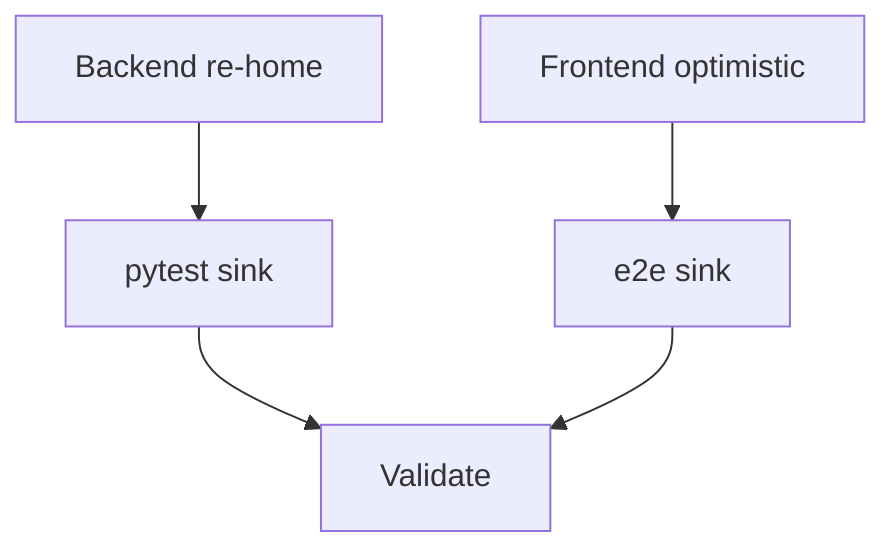

# Tasks: Finished Task Sinks to Bottom

**Goal**: Completing a task re-homes it to the bottom of its bucket (server-authoritative, optimistic UI mirror).
**Spec Folder**: /Users/ted/workspace/pomotodo/specs/20260617-1822-finished-task-to-bottom
**Acceptance**: /Users/ted/workspace/pomotodo/specs/20260617-1822-finished-task-to-bottom/PRODUCT.md (## Acceptance, VAL-SINK-*)

## Tasks

Execution: dag

```text
tasks[5]{id,title,depends_on,status,size,type,file,contract_refs,acceptance,write_set,backend,run_path,result}:
  T1,Backend: re-home task to bottom on done-transition,,done,S,impl,backend/repository.py,"VAL-SINK-001,VAL-SINK-002",uv run pytest tests/test_bucket.py -q,backend/repository.py,cursor,runs/T1,done: extended update_task re-home for finishing transition,
  T2,Pytest: done sinks + reopen keeps position,T1,done,S,test,tests/test_bucket.py,"VAL-SINK-001,VAL-SINK-002",uv run pytest tests/test_bucket.py -q,tests/test_bucket.py,cursor,runs/T2,done: sink + reopen pytest cases pass,
  T3,Frontend: optimistic bottom placement on toggle done,,done,S,impl,frontend/app.js,VAL-SINK-003,cmux browser eval tests/e2e_task_crud.js,frontend/app.js,cursor,runs/T3,done: optimistic sort_order bump on toggle done,
  T4,E2e: done task sinks to bottom of Today,T3,done,S,test,tests/e2e_task_crud.js,VAL-SINK-003,cmux browser eval tests/e2e_task_crud.js,tests/e2e_task_crud.js,cursor,runs/T4,done: e2e sink check; 14/14 failedCount 0,
  T5,Validate acceptance,"T2,T4",done,M,review,,"VAL-SINK-001,VAL-SINK-002,VAL-SINK-003,VAL-SINK-004",uv run pytest -q && npm test,,cursor,runs/T5,done: pytest 45 + npm 12 + e2e 14/14,
```

### T1: Backend — re-home task to bottom on done-transition

In `Repository.update_task` (backend/repository.py:78-89), extend the bucket-change re-home so a
status change active→done also sets `sort_order = _next_sort_order(target_bucket)`, with
`target_bucket = fields.get("bucket", task.bucket)` computed before the `setattr` loop. Idempotent
on an already-done task; reopen leaves `sort_order` untouched. No service/schema change. See
TECH.md for the exact replacement block.
Contract refs: VAL-SINK-001, VAL-SINK-002

### T2: Pytest — done sinks + reopen keeps position

Append `test_completing_task_sinks_to_bottom` and `test_reopening_task_keeps_bottom_position` to
tests/test_bucket.py using the existing `service` fixture (asserts in TECH.md).
Contract refs: VAL-SINK-001, VAL-SINK-002

### T3: Frontend — optimistic bottom placement on toggle done

In `handleTaskClick` toggle branch (frontend/app.js:1974-1986), when `newStatus === "done"` set
`task.sort_order` to (max `sort_order` among same-bucket tasks) + 1 before `renderAll()`, so the
row sinks immediately. Reopen path unchanged. See TECH.md for the snippet.
Contract refs: VAL-SINK-003

### T4: E2e — done task sinks to bottom of Today

In tests/e2e_task_crud.js, add a block that creates two fresh Today tasks, toggles the
first-created one done, waits for the optimistic re-render, and asserts it is the last
`.task-row` in `#today-list`; clean up both tasks (pseudo-code in TECH.md).
Contract refs: VAL-SINK-003

### T5: Validate acceptance

Run pytest + npm test + e2e_task_crud; confirm every VAL-SINK-* holds and the e2e report shows
`failedCount: 0`.
Contract refs: VAL-SINK-001, VAL-SINK-002, VAL-SINK-003, VAL-SINK-004

## Dependency View

```text
Requires:
  T1:
  T2: T1
  T3:
  T4: T3
  T5: T2 T4

Batches:
  1: T1 T3
  2: T2 T4
  3: T5
```


