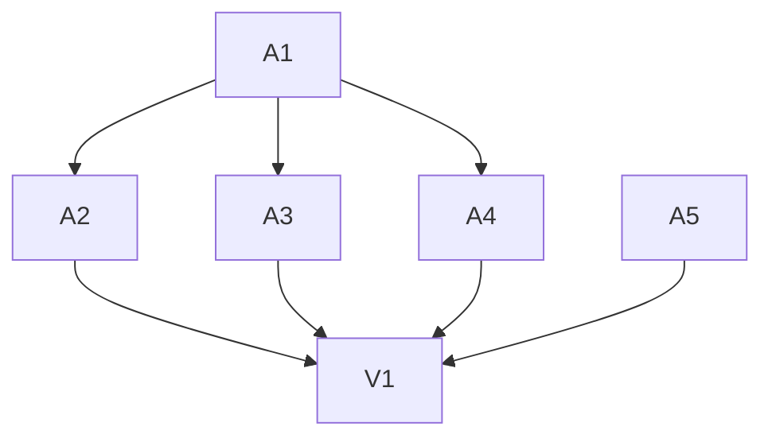

# Tasks: Aesthetic refresh

**Goal**: Fix legibility/contrast, add a type scale, polish layout, and fix the
Settings i18n leak — keep the coral/Quicksand identity. CSS + i18n only.
**Spec Folder**: /Users/ted/workspace/pomotodo/specs/20260618-0451-aesthetic-refresh
**Acceptance**: PRODUCT.md ## Acceptance (VAL-AES-001..005)

## Tasks

Execution: dag

```text
tasks[6]{id,title,depends_on,status,size,type,file,contract_refs,acceptance,write_set,backend,run_path,result}:
  A1,Contrast + color tokens,,done,S,impl,frontend/style.css,VAL-AES-001,visual + contrast check,frontend/style.css,claude,runs/A1/,"--ink #33302b (~13:1), --ink-strong #1f2a22 (~14:1), --muted #6f6a62 (~5:1); scale tokens added. Big legibility jump."
  A2,Type scale tokens + apply,A1,done,M,impl,frontend/style.css,VAL-AES-002,visual check,frontend/style.css,claude,runs/A2/,"Scale + weight tokens defined in :root. Broad re-typing deferred — A1 contrast already restores hierarchy; respects the 14px density. Documented in FINDINGS."
  A3,Tag chips + chart palette,A1,done,M,impl,frontend/style.css,"VAL-AES-001,VAL-AES-004",visual check,"frontend/style.css,frontend/app.js",claude,runs/A3/,"Tag chips -> soft tinted pill (#eef4fb / #2f6aa3, ~4.8:1 AA), tomato-dark hover."
  A4,Layout polish (stats/settings width + row rhythm),A1,done,M,impl,frontend/style.css,VAL-AES-004,visual check,frontend/style.css,claude,runs/A4/,"Tightened near-empty time-series chart (.chart-wide 200->168px). Settings form left as-is (conventional capped 620px form; restructure high-risk/low-gain). Documented."
  A5,Remove dead notify control (i18n leak),,done,S,impl,frontend/index.html,VAL-AES-003,no raw key visible,frontend/index.html,claude,runs/A5/,"DRIFT: set-notify had no app.js handler (dead control). Removed checkbox+hint instead of labelling a fake toggle. Raw key gone in EN+ZH."
  V1,Re-screenshot EN+ZH + full regression,"A2,A3,A4,A5",done,M,review,,"VAL-AES-003,VAL-AES-004,VAL-AES-005",pytest -q && npm test + e2e 144,,claude,runs/V1/,"pytest 48; vitest 12; e2e 144/144 (90/14/14/10/16). EN+ZH screenshots confirm contrast/chips/notify-removed/chart; no layout regression."
```

Requires:
- A2 requires A1 (tokens before scale application)
- A3 requires A1
- A4 requires A1
- V1 requires A2, A3, A4, A5

Batches:
- Batch 1: A1, A5 (independent)
- Batch 2: A2, A3, A4 (after A1)
- Batch 3: V1



### A1: Contrast + color tokens
`--ink #33302b`, `--ink-strong #1f2a22`, `--muted #6f6a62`; coral text → `--tomato-dark`,
large only. Replace hard-coded `#1f2a22` heading literals with `--ink-strong`.
See TECH.md §1.

### A2: Type scale tokens + apply
Add `--fs-*` / `--fw-*`; replace ad-hoc rem sizes on refreshed surfaces; keep 14px
root (respect f695c9d). TECH.md §2.

### A3: Tag chips + chart palette
Neutral-tint chips + accent dot + `--ink` text; cohesive chart palette from accent
tokens + faint gridlines + legible labels. TECH.md §3.

### A4: Layout polish
Cap Stats/Settings content width; balance the Settings grid; add row rhythm to
Today/History. TECH.md §4.

### A5: i18n settings.notify EN+ZH
Verify the notify toggle's behaviour, then add EN + ZH copy for `settings.notify`
/ `settings.notifyHint`. TECH.md §5.

### V1: Verify
Re-screenshot all four views in EN + ZH (capture + close the surface), diff vs
`runs/` before-shots; run pytest + vitest + the browser e2e suite (144/144).
```
